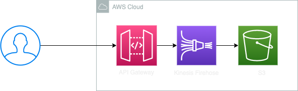

# アクセス解析

AWS を使用したセルフホストのアクセス解析システム

取得できるログの例

```{json}
{"time": "30/Apr/2023:11:01:35 +0000","ip": "xxx.xxx.xxx.xxx","data": {"type":"page","properties":{"title":"","url":"https://example.com/index.html","path":"/index.html","hash":"","search":"","width":647,"height":1039},"options":{},"userId":"user-id-xyz","anonymousId":"e8a602e8-9688-4c04-8e1f-06b7e1e95658","meta":{"rid":"9eb11317-53f6-46f2-8a73-6e3b0259b8d0","ts":1682852495299,"hasCallback":true}}}
{"time": "30/Apr/2023:11:01:46 +0000","ip": "xxx.xxx.xxx.xxx","data": {"type":"page","properties":{"title":"","url":"https://example.com/index.html","path":"/index.html","hash":"","search":"","width":647,"height":1039},"options":{},"userId":"user-id-xyz","anonymousId":"e8a602e8-9688-4c04-8e1f-06b7e1e95658","meta":{"rid":"38884f2e-9108-4440-9d8f-0c6a2c08da72","ts":1682852506092,"hasCallback":true}}}
{"time": "30/Apr/2023:11:01:47 +0000","ip": "xxx.xxx.xxx.xxx","data": {"type":"page","properties":{"title":"","url":"https://example.com/index.html","path":"/index.html","hash":"","search":"","width":647,"height":1039},"options":{},"userId":"user-id-xyz","anonymousId":"e8a602e8-9688-4c04-8e1f-06b7e1e95658","meta":{"rid":"438bf7d1-32f9-4481-ba62-14ad5f0b18ee","ts":1682852507411,"hasCallback":true}}}
```

## 設計



Kinesis Firehose を API Gateway から直接呼び出す形とする。

### Q. なぜ、Kinesis Firehose を使用するのか？

以下の理由より、CloudWatch Logs ではなく、Kinesis Firehose を使用する。

- CloudWatch Logs は、PutLogEvents API に対してリージョンレベルで 800 リクエスト/秒の制限がある。
- CloudWatch Logs は、ストレージ価格が高い。(0.76 USD/GB)

[CloudWatch Logs のクォータ](https://dev.classmethod.jp/articles/cloudwatch-logs-log-stream-remove-transaction-quota/)

### Q. なぜ、Lambda -> S3 構成ではなく、Kinesis Firehose を挟むのか？

以下の理由により、間に Kinesis Firehose を挟むことで、レコードをバッファリングし、書き込み効率と、データーの損失を防ぐ。

- S3 では、ファイルの追記はできないため、1 呼び出しで、1 ファイル書き込むことになる。
- Read-Modify-Write 方式にすると、同時実行時にレコードが消失する可能性がある。
- Lambda を使用したくない。

### Q. なぜ、API Gateway -> DynamoDB 構成ではないのか？

その構成にした場合は、書き込み部のコスト比で、約 1.5 倍のコストがかかる。
また、実際に解析する際に読み出すために、さらにコストがかかる。

| サービス          | コスト                   | 試算                                                       |
| ----------------- | ------------------------ | ---------------------------------------------------------- |
| DynamoDB 書き込み | 1.4269 USD/1M WRU        | 4.2807 USD/月(0.1M リクエスト x 30 日 x 1.4269 USD/1M WRU) |
| DynamoDB 保存     | 0.285 USD/GB (25GB 無料) | 3.2775 USD/月((36.5GB - 25GB) x 0.285 USD/GB)              |

## 使い方

### パラメータの指定

cdk.json

| パラメータ名                  | 説明                                                                                   |
| ----------------------------- | -------------------------------------------------------------------------------------- |
| `access-log-bucket-name`      | バケット名(例: "access-log-bucket-123456789012")                                       |
| `access-log-stream-name`      | ストリーム名(例: "access-log-stream")                                                  |
| `cross-origin`                | クロスオリジン設定 (例: ["*"])                                                         |
| `interval-in-seconds`         | バッファサイズの間隔(例: 60)                                                           |
| `buffer-size-in-mb`           | バッファサイズ(例: 1)                                                                  |
| `athenaQueryResultBucketName` | Athena のクエリ結果を保存するバケット名(例: "athena-query-result-bucket-123456789012") |

### Stack 生成例

```{typescript}
const app = new cdk.App();

const bucketName = app.node.tryGetContext("access-log-bucekt-name") as string;
const streamName = app.node.tryGetContext("access-log-stream-name") as string;
const crossOrigin = app.node.tryGetContext("cross-origin") as [string];

new AccessLogStack(app, "AccessLogStack", {
  bucketName: bucketName,
  streamName: streamName,
  crossOrigin: crossOrigin,
});
```

### フロント側

[クライアント側の実装例](./sample-client/README.md)

### アクセス解析データの取得

AWS AThena で、アクセス解析データを取得する。
ただし、ワークグループは、`access_log` とする。

```{sql}
SELECT * FROM "access_log"."acess_log" limit 10;
```

## Ops

### デプロイ

デプロイは、CDK により行う。

```{bash}
npx cdk deploy --all
```

デプロイ前のテスト。

```{bash}
npm test
```

### 監視

#### API Gateway

| 項目     | 説明         | 監視周期 | 設定                                                 |
| -------- | ------------ | -------- | ---------------------------------------------------- |
| 4XXError | 4XX の数     | 1 分間   | 監視しない。                                         |
| 5XXError | 5XX の数     | 1 分間   | エラーは原則でないはずなので、1 回以上を閾値とする。 |
| Count    | リクエスト数 | 1 分間   | 1 K リクエスト/秒。 80%を閾値とする。                |

#### Kinesis Firehose

| 項目                              | 説明                                 | 設定              |
| --------------------------------- | ------------------------------------ | ----------------- |
| PutRequestsPerSecondLimitExceeded | レコードの書き込み速度が上限を超えた | 1 分間に 1 回以上 |

### セキュリティ

OWASP ZAP を使用して、セキュリティセキュリティスキャンを行った。
以下結果(ただし、クロスオリジン設定を`["https://example.com"]`としている)

```{bash}
cd security
docker compose run api-scan
```

| Name                                                    | Risk Level    | Number of Instances |
| ------------------------------------------------------- | ------------- | ------------------- |
| A Client Error response code was returned by the server | Informational | 59                  |
| Non-Storable Content                                    | Informational | 1                   |
| Re-examine Cache-control Directives                     | Informational | 1                   |
| Storable and Cacheable Content                          | Informational | 1                   |

[レポート](./security/api-scan-report.md)

### オペレーション

| サービス項目 | 設計内容                           | 設定                                                           |
| ------------ | ---------------------------------- | -------------------------------------------------------------- |
| サービス時間 | サービス時間                       | 24/365                                                         |
|              | 計画停止予定通知                   | 未設定                                                         |
| 可用性       | サービス稼働率                     | 99.7%                                                          |
|              | ディザスタリカバリ                 | なし                                                           |
|              | 重大障害時の代替手段               | なし                                                           |
|              | アップグレード方針                 | 未設定                                                         |
| 信頼性       | 平均復旧時間                       | 未設定                                                         |
|              | システム監視基準                   | 監視しない                                                     |
|              | 障害通知プロセス                   | 未設定                                                         |
|              | 障害通知時間                       | 未設定                                                         |
|              | 障害監視間隔                       | 未設定                                                         |
|              | サービス提供状況の報告方法／間隔   | 未設定                                                         |
|              | ログの取得                         | 未設定                                                         |
|              | データ保証の要件                   | 未設定                                                         |
|              | バックアップデータの保存期間       | 未設定                                                         |
|              | データ消去の要件                   | 未設定                                                         |
| サポート     | サービス提供時間帯（障害対応）     | しない                                                         |
|              | サービス提供時間帯（一般問合せ）   | しない                                                         |
| 性能基準     | オンライン応答時間）               | ベストエフォート(ユーザーはコールするだけで結果をまたないため) |
|              | バッチ処理時間                     | -                                                              |
|              | カスタマイズ性                     | -                                                              |
|              | 外部接続性                         | なし                                                           |
|              | 同時接続ユーザ数                   | ユーザ数ではなく 1000 リクエスト/秒                            |
| セキュリティ | 公的認証取得の要件                 | 未取得                                                         |
|              | アプリケーションに関する第三者評価 | OWASP ZAP                                                      |
|              | 情報取扱者の制限                   | アクセスログバケットへの制限で行う。                           |
|              | 通信の暗号化レベル                 | SSL                                                            |

[出典](https://home.jeita.or.jp/is/committee/solution/guideline/080131/index.html)

## 可用性

以下より、システムの可用性は、99.7%程度とする。

### API Gateway の可用性

99.95%

[出典](https://aws.amazon.com/api-gateway/sla/?did=sla_card&trk=sla_card)

### Kinesis Firehose の可用性

99.9%

[出典](https://aws.amazon.com/jp/kinesis/sla/?did=sla_card&trk=sla_card)

### S3

99.9%

[出典](https://aws.amazon.com/jp/s3/sla/?did=sla_card&trk=sla_card)

## コスト計算

1 KiB/レコードとし、100K リクエスト/日で見積もる。(100 MiB/日)
年間ストレージは、36.5 GiB (100MiB x 365 日) とする。

下記より、14.3 USD/月程度となる。

| サービス         | コスト                                   | 試算                                                            |
| ---------------- | ---------------------------------------- | --------------------------------------------------------------- |
| API Gateway      | 4.25 USD/1M リクエスト                   | 12.75 USD/月 ((100K リクスト x 30 日) x 4.25 USD/1M リクエスト) |
| Kinesis Firehose | 0.036 USD/GB (1 レコード 5 KiB 切り上げ) | 0.54 USD/月 (0.036 USD/GB x 0.5 GiB x 30 日)                    |
| S3               | 0.025 USD/GB                             | 0.92 USD/月 (0.025 x 36.5 GiB)                                  |

東京リージョンでの料金。

[API Gateway の料金](https://aws.amazon.com/jp/api-gateway/pricing/)
[Kinesis Firehose の料金](https://aws.amazon.com/jp/kinesis/data-firehose/pricing/)
[S3 の料金](https://aws.amazon.com/jp/s3/pricing/)

## クォータ

以下、東京リージョン(ap-northeast-1)でのクォータの例。
特にクォータを引き上げずとも、1000 リクスト/秒までは可能。

### API Gateway のクォータ

アカウント・リージョンごとに以下のクォータがある。

- 10K リクエスト/秒

[出典](https://docs.aws.amazon.com/ja_jp/apigateway/latest/developerguide/limits.html)

### Kinesis Firehose のクォータ

- レコードサイズ: 100KiB
- Direct PUT: 100k レコード/秒, 1k リクエスト/秒, 1 Mib/秒

[出典](https://docs.aws.amazon.com/firehose/latest/dev/limits.html)
